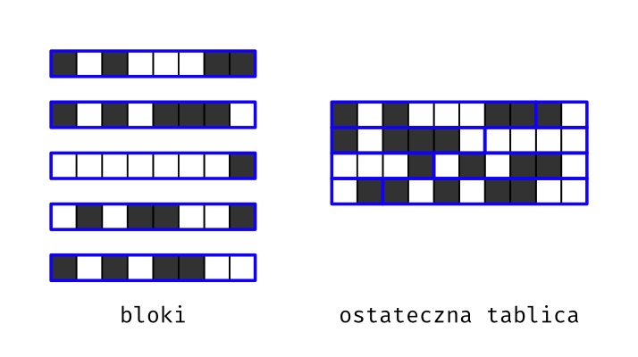

# Sprawozdanie z projektu The Game of Life

## Działanie

## 1. Opis tematyki projektu

Nasz projekt - Gra w życie Johna Conwaya jest to uporządkowany zbiór komórek. Komórki przyjegając do siebie tworzą dwuwymiarową siatkę.  
Każda komówka zawiera się w jednym z dwóch stanów - żywa lub martwa. Dodatkowo każda komórka posiada 8 sąsiadów, czyli komórki przylegające  
do niej z każdej strony ( na południu, południowym-zachodzie, zachodzie, północnym-zachodzie, północy, północnym-wschodzie, wschodzie   
i południowym-wschodzie). Liczba sąsiadów oraz obecny stan komórki określają stan tej komórki w następnej generacji.  
Zasady gry:   
|Obecny stan|Liczba żywych sąsiadów|Stan w następnej generacji|
|-|-|-|
|Martwa|`3`|Żywa|
|Martwa|`!3`|Martwa|
|Żywa|`2 || 3`|Żywa|
|Żywa|`!(2 || 3`)|Martwa|

## 2. Opis struktury projektu
Projekt podzielony jest na 11 plików:  
8 plików źródłowych: `fileio.c` `friends.c` `generate.c` `helper.c` `life.c` `main.c` `pathutils.c` `pngout.c`  
2 pliki nagłówkowe: `life.h` `overkill.h`  
1 Makefile: `Makefile`  
## 3. Parametry wywołania programu

### Opcje:
    -n  LICZBA_GENERACJI
        Ilość generacji gry do wygenerowania

        LICZBA_GENERACJI = 0 nie stworzy nowych generacji,
        a da na wyjściu plik PNG obecnej generacji.
        LICZBA_GENERACJI > 0 stworzy nowe generacje.
        LICZBA_GENERACJI < 0 nie jest dozwolona.

    -file PLIK_WEJŚCIOWY
        Stan początkowy.

    -out KATALOG_WYJŚCIOWY (opcjonalny)
        Katalog, do którego pliki wyjściowe będą zapisywane.

    -wrap (opcjonalne)
        Krawędzie będą się zawijały tworząc tablicę bez granic.

### Opcje PNG:
    -png-circles (opcjonalny)
        Tworzy okrągłe komórki w plikach wyjściowych PNG.

    -png-size ROZMIAR (opcjonalny)
        Ustawia rozmiar komórek w plikach wyjciowych PNG.
        Musi być większy niż 0. Domyślnie ustawione na 1.

    -png-overkill PLIK_OVK (opcjonalny)
        

## 4. Szczegóły implementacyjne

## 5. Testowanie programu i wyniki

Program testowany był przy użyciu konstrukcji gry w życie, których kolejne generacje były znane.

### Struktura plików wynikowych

Program otwiera i zapisuje pliki `.life`. Pliki life zapisywane są w formacie binarnym.

Zawartość plików jest podzielona na 2 części: nagłówek i dane.

Na nagłówek pliku składają się 3 wartości:

|Wartość|Typ danych|
|-|-|
|Identyfikator ("LIFE")|`char[4]`|
|Szerokość tablicy|`unsigned int`|
|Wysokość tablicy|`unsigned int`|

Dane tablicy są zapisane w formie ciągu par ilość-dane. Aby przekonwertować dane z pliku do danych, należy "rozwinąć" pary w ciąg `char`-ów:

|Dane w pliku|Ciąg `char`-ów|
|-|-|
|`03 4A 01 7F 02 51`|`4A 4A 4A 7F 51 51`|

Z każdego z uzyskanych `char`-ów należy "wyłuskać" bity i odwrócić ich kolejność, by uzyskać 8-komórkowe bloki:

Bloki należy następnie ułożyć od lewej do prawej (przechodząc do kolejnej linii, gdy komórki przekraczają szerokość tabeli):

## 6. Wnioski i spostrzeżenia
Projekt był dla nas ciekawy, a praca w zespole przebiegała płynnie. W pracy zdalnej pomocne okazało się  
rozszerzenie `Live Share` w `Visual Studio Code`, które pomogło w pracy zespołowej zdalnie. Używanie Git'a i GitHub'a jest bardzo proste  
i zdecydowanie ułatwia pracę nad projektem.

## Autorzy
* [Hubert Nakielski](https://github.com/nakielsh)
* [Kacper Seredyn](https://github.com/scintilla4evr)